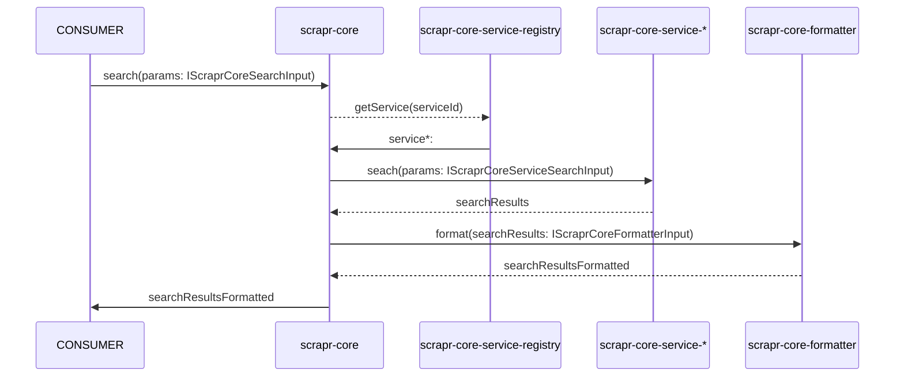

# scrapr-core

> *scrapr-core* will enable SERP data to be scraped and returned in real time.

## Contents

- [Description](#description)
- [Classes](#classes)
- [Class methods](#class-methods)
- [Dependencies](#dependencies)
- [Pseudocode: ScraprCore](#pseudocode-scraprcore)
- [Sequence diagram](#sequence-diagram)

## Description

- This package will provide the public entry point to the *scrapr-core* collection of packages.
- It will be a library that will enable SERP data to be scraped and returned in real time.
- It will be used within the *scrapr-api* package.

## Classes

The following classes will be contained within the scrapr-core package:

- ScraprCore
- ParamFilter
- ParamValidater

## Class methods

- **ScraprCore.search**(args: IScraprCoreSearchInput): *IScraprCoreSearchOutput* (static) [PUBLIC]
- **ParamFilter.filter**(args: IScraprCoreSearchInput): *IScraprCoreSearchInput* (static) [PRIVATE]
- **ParamValidater.parse**(args: IScraprCoreSearchInput): *void* (static) [PRIVATE]

## Dependencies

The following *scrapr-\** packages will be required by *scrapr-core* as dependencies:

- scrapr-core-formatter
- scrapr-core-interfaces
- scrapr-core-service-registry

## Pseudocode: ScraprCore

The pseudocode below was written on the 1st of August 2024 (prior to the start of development).


```TypeScript
import { ParamFilter } from "./ParamFilter";
import { ParamValidater } from "./ParamValidater";
import { ScraprCoreFormatter } from "datr-tech/scrapr-core-formatter";
import { ScraprCoreServiceRegistry } from "datr-tech/scrapr-core-service-registry";
import { IScraprCore, IScraprCoreSearchInput, IScraprCoreSearchOutput } from "datr-tech/scrapr-core-interfaces";

export class ScraprCore: IScraprCore {
  /**
   * ScraprCore
   * 
   * A class that supports SERP data searches / scrapes.
   *
   * @param {IScraprCoreSearchInput} params
   * @return IScraprCoreSearchOutput[]
   */
  public static search(... params: IScraprCoreSearchInput): IScraprCoreSearchOutput[] {
    ParamValidater.validate(params);
    
    const paramsFiltered = ParamFilter.filter(params);
    const { formatId, serviceIds } = paramsFiltered;
    const searchResults: IScraprCoreSearchOutput[] = [];

    for (let serviceId in serviceIds) {
        let service = ScraprCoreServiceRegistry.getService(serviceId);
        let searchResultsPerService = service.search(paramsFiltered);
        let searchResultsPerServiceFormatted = ScraprCoreFormatter.format(formatId, seviceOutput)
        
        searchResults.push(searchResultsPerServiceFormatted);
    }

    return searchResults;
  }
}
```

## Pseudocode: ParamValidater

The pseudocode below was written on the 1st of August 2024 (prior to the start of development).

```TypeScript
/**
 * ParamValidater
 * 
 * A class that provides validation functionality for the search params.
 * It either throws an error or returns void. 
 * 
 * @param {IScraprCoreSearchInput} params
 */
export class ParamValidater: IScraprCoreParamValidater {
    public static validate(... params: IScraprCoreSearchInput): void {
        const { searchTerm } = params;
        
        this.validateSearchTerm(searchTerm);
        ...
    }

    private static validateSearchTerm(searchTerm: string): void {
        if (blackList.contains(searchTerm)) {
            throw new TypeError("ParamValidater: The search term must not contain one of the blacklisted words.")
        } 
    }
}

```

## Pseudocode: ParamFilter

The pseudocode below was written on the 1st of August 2024 (prior to the start of development).

```TypeScript
/**
 * ParamFilter
 * 
 * A class that provides filtering functionality for the search params.
 * 
 * @param {IScraprCoreSearchInput} params
 */
export class ParamFilter: IScraprCoreParamFilter {
    public static filter(... params: IScraprCoreSearchInput): IScraprCoreSearchInput {
        const paramsClone = { ... params };
        const { searchTerm } = paramsClone;

        paramsClone.searchTerm = this.filterSearchTerm(searchTerm);

        return paramsClone;
    }

    private static filterSerchTerm(searchTerm: string): string {
        // If required, filter the search term
    }
}

```

## Sequence diagram

The Mermaid based sequence diagram below was written on the 1st of August 2024 (prior to the start of development).

